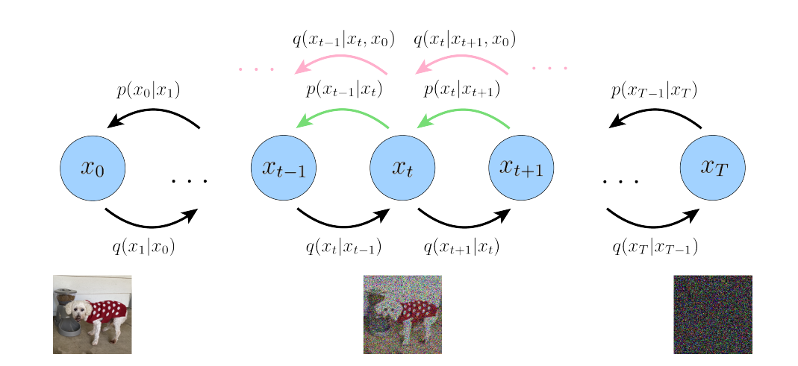
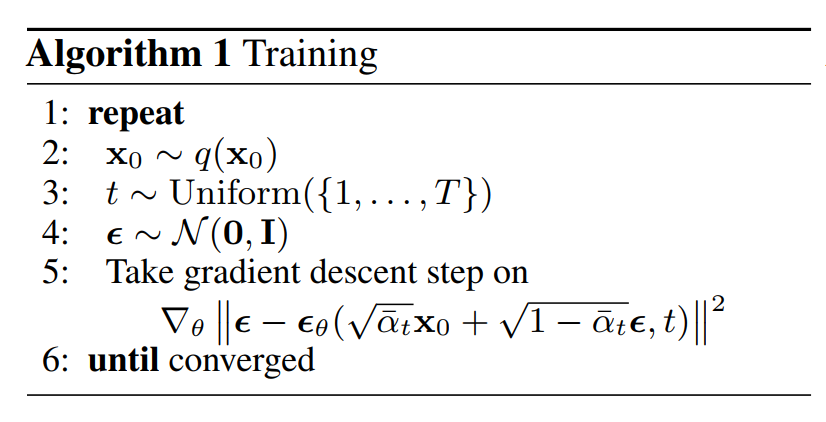
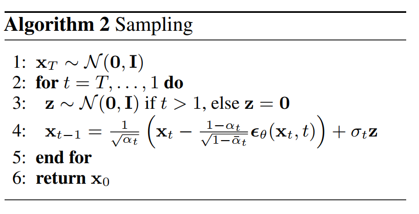

# Denoising Diffusion Model

## 数学基础

### Jenson 不等式

#### 定义

设 $X$ 是一个随机变量，$f$ 是一个定义在 $X$ 的值域上的凸函数。那么，Jensen 不等式表示为：

$$ f(\mathbb{E}[X]) \leq \mathbb{E}[f(X)] $$

其中，$\mathbb{E}[X]$ 是 $X$ 的期望值，$\mathbb{E}[f(X)]$ 是 $f(X)$ 的期望值。

#### 取等条件

Jensen不等式取等号的条件是：

1. $f$ 是一个线性函数，即 $f(x) = ax + b$ 形式的函数，其中 $a$ 和 $b$ 是常数。
2. 或者，随机变量 $X$ 是退化的（即 $X$ 是常数），因此 $\mathbb{E}[X] = X$。

### KL 散度  KL Divergence

#### 定义

对于两个概率分布 P 和 Q，KL 散度 $D_{KL}(P||Q)$ 定义如下：
$$
D_{KL}(P || Q) = \sum_{x\in \chi}P(x)\log \frac{P(x)}{Q(x)}
$$
连续情况下：
$$
D_{KL}(P || Q) = \int_{-\infty}^{\infty}p(x)\log \frac{p(x)}{q(x)}
$$
KL 散度衡量的是当我们使用分布 Q 来近似分布 P 时所**损失的信息量**。它表示的是使用分布 Q 而不是分布 P 进行编码时，所增加的额外信息量。

#### 特性

1. 非负性：KL 散度总是非负的，即 $D_{KL}(P||Q) \geq 0$。当且仅当 $P=Q$ 时，KL 散度为 0。

   证明：$-log(x)$ 为凸函数，根据 Jenson 不等式：
   $$
   \begin{aligned}
   D_{KL} &= \sum_{i=1}^{n} P(x_i)\cdot \log \frac{P(x_i)}{Q(x_i)}\\
   &= \sum_{i=1}^{n} P(x_i)\cdot (-\log \frac{Q(x_i)}{P(x_i)})\\
   &\geq -\log(\sum_{i=1}^{n}P(x_i)\cdot \frac{Q(x_i)}{P(x_i)}) \\
   &=-\log (\sum_{i=1}^{n}Q(x_i))\\
   &=0
   \end{aligned}
   $$
   
2. 非对称性：KL 散度是非对称的，$D_{KL}(P||Q) \neq D_{KL}(Q||P)$。

> （需要高斯积分技巧）高斯分布的 KL 散度：若 $p \sim N(\mu_1, \sigma_1^2)$，$q\sim N(\mu_2,\sigma_2^2)$​，则有：
> $$
> \begin{aligned}
> D_{KL}(p\| q) &= \int_{-\infty}^{\infty}\frac{1}{\sqrt{2\pi}\sigma_1}e^{-\frac{(x-\mu_1)^2}{2\sigma_1^2}}\cdot \log(\frac{e^{-\frac{(x-\mu_1)^2}{2\sigma_1^2}}/\sigma_1}{e^{-\frac{(x-\mu_2)^2}{2\sigma_2^2}}/\sigma_2}) \\
> &=\log \frac{\sigma_2}{\sigma_1} + \frac{\sigma_1^2+(\mu_1-\mu_2)^2}{2\sigma_2^2}-\frac{1}{2}
> \end{aligned}
> $$
> 特别的，若 $\sigma_1=\sigma_2=\sigma$：
> $$
> D_{KL}(p\|q)=\frac{1}{2\sigma^2}\|\mu_1-\mu_2\|^2
> $$

3. KL 散度可以写为：
   $$
   D_{KL}(p|| q) = H(p, q) - H(p)
   $$
   也就是 **交叉熵 - 原分布的熵**

4. KL 散度还可以写为：
   $$
   D_{KL}(p|| q) = \mathbb{E}_{x\sim p(x)}\left[\log \frac{p(x)}{q(x)}\right]
   $$
   也就是 **$x$ 服从分布 $p(x)$ 下，$\log \frac{p(x)}{q(x)}$ 的期望。**

### 重参数化方法  Reparameterization

若想从目标分布 $\mathcal{N}(\mu, \sigma^2)$ 进行采样，可以先从标准高斯分布中采样得到一个随机变量 $\epsilon$，将采样的随机变量进行线性变换：
$$
z = \mu + \sigma\cdot\epsilon, \quad \epsilon \sim \mathcal{N}(0,I)
$$

> 重参数化特性：**可微性**， 这种重参数化方式使得采样过程保持可微性，因为 $\mu$ 和 $\sigma$ 只是通过简单的线性变换作用在 $\epsilon$ 上。这意味着在反向传播时，梯度可以通过 $\mu$ 和 $\sigma$​ 传递，从而可以优化这些参数。

下文中有一个记号：
$$
\mathcal{N}(x;\mu,\sigma^2)
$$
表示 $x$ 是 $\mathcal{N}(\mu,\sigma^2)$ 分布的一个抽样，利用重参数方法，可以写作：
$$
x = \mu + \sigma\cdot\epsilon, \quad \epsilon \sim \mathcal{N}(0,I)
$$

### 高斯分布的线性组合

设 x 和 y 是**独立**的高斯分布随机变量，并且 $x \sim \mathcal{N}(\mu_x, \sigma_x^2)$ ，$y \sim \mathcal{N}(\mu_y, \sigma_y^2)$，则其线性组合：
$$
\alpha x + \beta y \sim \mathcal{N}(\alpha\mu_x + \beta\mu_y, \alpha^2\sigma_x^2+\beta^2\sigma_y^2)
$$
特别的，若 x 和 y 是**独立的标准高斯分布**，也就是 $x\sim\mathcal{N}(0,I)$，$y\sim\mathcal{N}(0,I)$，则其线性组合：
$$
\alpha x + \beta y \sim \mathcal{N}(0, \alpha^2+\beta^2)
$$

### 似然函数 LF 和最大似然估计 MLE

1. 似然函数 `Likelihood Function`

   度量在给定参数的条件下，观测数据的可能性。
   
   数学描述：给定参数 $\theta$ 和一组观测数据 $x$，似然函数 $L(\theta)$ 定义为观测数据在这些参数下出现的概率。表示为：
   $$
   L(\theta;x) = p(x|\theta)
   $$
   对数似然函数可以表示为：
   $$
   \ell(\theta;x)=\log L(\theta;x) = \log p(x|\theta)
   $$
   

> 例如设一枚硬币抛出时正面朝上的概率为 $p$​，做三次独立抛掷实验，发现两次向上一次向下，如何建  模这个实验，就是似然函数可以干的事情。虽然似然函数可以用概率分布来计算，但是似然函数并不等同于概率分布（比如在概率分布后加一个常数也可以作为似然函数）[From ChatGPT 4o]：
>
> - **概率密度函数**用于描述在给定参数下数据出现的概率。
>
> - **似然函数**用于在给定观测数据下估计参数的可能性。

2. 最大似然估计 `Maximum Likelihood Estimation`

   找一组参数 $\theta$，使得观测数据的似然函数最大化。一般先取 $\log$​ 求最大值。这里也可以看出：**似然函数并不一定是概率**，也并不一定是 0 到 1 之间。

### Expectation-Maximization 算法和置信下界 ELBO

> 参考 [数理统计讲义](https://bookdown.org/hezhijian/book/est.html)，EM 算法用于求解**不完备数据的最大似然估计**，在这种情况中，直接对观测数据求最大似然估计比较困难。但是可以借用隐变量来获取似然函数的置信下界。
>
> 注：这里下标 $\mathbb{E}_{q(z|x,\theta)}$ 均为 $\mathbb{E}_{z\sim q(z|x,\theta)}$ 的省略。

设完备数据为 $(x,z)$，其中 $x$ 为观测数据，$z$ 不可观测数据（潜在变量或隐变量 `latent variation`）

设观测数据 $x$ 的似然函数为 $L(\theta;x) = p(x|\theta)$​，由联合分布的特性：
$$
\begin{aligned}
L(\theta ; x) &= p(x|\theta)=\int p(x, z | \theta) dz \\
&= \int \frac{q(z|x, \theta) p(x, z | \theta)}{q(z|x, \theta)} dz \\
&= \mathbb{E}_{q(z|x, \theta)} \left[ \frac{p(x, z | \theta)}{q(z|x, \theta)} \right]
\end{aligned}
$$
其中 $ p(y, z | \theta) $ 为完备数据的密度函数，$ q(z|x, \theta) $ 为密度函数且满足：如果 $ q(z|x, \theta) = 0 $，则 $p(x, z | \theta ) = 0 $。对数似然函数：
$$
\ell (\theta ; x) = \log \left( \mathbb{E}_{q(z|x, \theta)} \left[ \frac{p(x, z | \theta)}{q(z|x, \theta)} \right] \right) \geq \mathbb{E}_{q(z|x, \theta)} \left[ \log \left( \frac{p(x, z | \theta)}{q(z|x, \theta)} \right) \right])。
$$
其中应用了$-log(x)$ 为凸函数和 Jenson 不等式。根据 Jenson 不等式的取等条件，当且仅当 $p(x, z | \theta)/q(z|x, \theta)$​ 是一个与 $z$ 无关的常数，等号成立。

还有一种方式可以推导出这个结果，利用 $\int q(z|x,\theta) \text{d} z= 1$，可得：
$$
\begin{aligned}
\ell (\theta ; x) &= \log p(x|\theta) \\
&= \log p(x|\theta) \int q(z|x,\theta) \text{d}z \\
&= \int q(z|x,\theta)\log p(x|\theta) \text{d}z \\
&= \mathbb{E}_{q (z|x, \theta)} [\log p(x|\theta)] \\
&= \mathbb{E}_{q (z|x, \theta)} \left[ \log \frac{p(x, z|\theta)}{p(z|x,\theta)} \right] \\
&= \mathbb{E}_{q (z|x, \theta)} \left[ \log \frac{p(x, z|\theta)q (z|x, \theta)}{p(z|x,\theta)q (z|x, \theta)} \right] \\
&= \mathbb{E}_{q (z|x, \theta)} \left[ \log \frac{p(x, z|\theta)}{q (z|x, \theta)} \right] + \mathbb{E}_{q (z|x, \theta)} \left[ \log \frac{q (z|x, \theta)}{p (z|x, \theta)} \right] \\
&= \mathbb{E}_{q (z|x, \theta)} \left[ \log \frac{p(x, z|\theta)}{q (z|x, \theta)} \right] + D_{KL}(q (z|x, \theta)||p (z|x, \theta)) \\
&\geq \mathbb{E}_{q (z|x, \theta)} \left[ \log \frac{p(x, z|\theta)}{q (z|x, \theta)} \right]
\end{aligned}
$$
当且仅当 $q(z|x,\theta) = p(z|x,\theta)$ 时，取等号。事实上，这和上述的取等条件：当且仅当 $p(x, z | \theta)/q(z|x, \theta)$ 是一个与 $z$ 无关的常数是一致的。

> 若 $q(z|x,\theta) = p(z|x,\theta)$，则：
> $$
> \frac{p(x, z | \theta)}{q(z|x, \theta)} = p(x|\theta)\cdot \frac{p(z|x,\theta)}{q(z|x,\theta)} = p(x|\theta)
> $$
> 是一个与 $z$​ 无关的常数。
>
> 若 $p(x, z | \theta)/q(z|x, \theta)$ 是一个与 $z$ 无关的常数：
> $$
> \frac{p(x, z | \theta)}{q(z|x, \theta)} = p(x|\theta)\cdot \frac{p(z|x,\theta)}{q(z|x,\theta)}
> $$
> 所以 $\frac{p(z|x,\theta)}{q(z|x,\theta)}$ 必是一个与 $z$ 无关的常数，由于二者对 z 的积分均为 1，所以该常数只能为 1，也就是 $q(z|x,\theta) = p(z|x,\theta)$

也就是说：**最大似然有一个置信下界（Evidence Lower Bound）ELBO**

EM 算法后续的迭代过程忽略。

### 联合分布和边缘分布

对于两个连续型随机变量 $X$ 和 $Y$ 的联合概率密度函数 $f_{X,Y}(x,y)$​，可以通过积分得到各自的边缘概率密度函数。
$$
f_X(x) = \int_{-\infty}^{\infty} f_{X,Y}(x,y) \, dy
$$

$$
f_Y(y) = \int_{-\infty}^{\infty} f_{X,Y}(x,y) \, dx
$$

条件分布也可以通过联合分布和边缘分布得到：
$$
f_{Y \mid X}(y \mid x) = \frac{f_{X,Y}(x,y)}{f_X(x)}
$$

### Fubini 定理

假设 $A$ 和 $B$ 是完备测度空间。假设 $f(x,y)$ 是 $A \times B$ 上的可测函数。

如果 $f(x,y)$ 在 $A\times B$ 上绝对可积，即：
$$
 \int_{A \times B} |f(x, y)| \, d(x, y) < \infty, 
$$
那么 
$$
\int_A \left( \int_B f(x, y) \, dy \right) dx = \int_B \left( \int_A f(x, y) \, dx \right) dy = \int_{A \times B} f(x, y) \, d(x, y)
$$

## 生成模型  Generative Model

Generative Model 本质是通过一个已知的概率模型来拟合所给的数据样本。

需要通过模型得到一个带参数的分布。即如果训练数据的分布函数为 $p_{data}(x)$ ，生成样本的分布函数为 $p_{model}(x)$​ ，希望**得到的分布**和**训练数据的分布**尽可能相似。

### Variation AutoEncoder  VAE

VAE 的架构设计了两个网络：Encoder，将观察的数据 x 映射到隐变量 z 上；Decoder，从采样的 z中解码回 x。从实践的角度，VAE 需要训练两套参数 $\theta$ 和 $\phi$​ 

 VAE 方法使用最大似然路线和上述的 ELBO。看起来很完美，但是问题在于 ELBO 只是一个下界，离真实分布很远的下界也是下界。必须把这个下界抬的足够高才能得到一个好的效果。由于需要用深度学习网络来建模近似分布 $q(z|\eta)$，而深度学习的优化算法是基于反向传播算法（Back Propagation），如果要从分布 $q(z|\eta)$​ 中采样，采样这个操作会**打断梯度的传递**。

所以说使用最大似然路线的 VAE 方法，效果并不如 GAN。要想避免这个问题，只能使用高斯分布加重参数化的技巧来避免无法求梯度的问题。事实上，VAE 算法在实现的时候增加了多个假设，有些牵强，反过来限制了它能力的上限。

业界针对 VAE 的问题做了很多尝试，DM 可以算作是其中一种比较成功的尝试。

## Denoising Diffusion Probabilistic Model

VAE 想一步到位，同时训练 Encoder 和 Decoder，能够将原始图片映射到隐变量中，又能解码回来，看起来是非常困难的。一个常见的降低问题难度的思路是能不能只训练 Encoder 或 Decoder。而 Diffusion Model 就是去掉了 Encoder 部分的学习，只关心如何学好 Decoder，即逆向过程中如何重建数据。

DDPM 建模：

### 前向过程

#### 简单介绍

输入图像 $x_0$，经过时间 $T$​ 个步骤，逐步向其添加高斯噪声。

> 这里的前向过程并不等同于 MLP 中的前向过程 [From ChatGPT 4o]：
>
> - Denoising Deffusion Model 的前向过程是一个**逐步添加噪声**的过程。目标是学习在**添加噪声**和**去除噪声**之间的映射，从而能够从噪声中恢复原始图像。
> - MLP 的前向过程是通过多层计算，将输入数据逐步**变换成输出数据**。目标是通过学习数据的特征，进行 Classfication 或 Regression 等下游任务。

当 $T$​ 足够大时，得到的加噪后的图像便接近一个**高斯噪声图像**。DDPM Paper 中给出的典型值为 1000。

#### 数学描述

> 设在前向的每一步通过向图像 $x_{t-1}$ 中添加高斯噪声得到 $x_t$ 的过程称为 $q(x_t|x_{t-1})$​
>
> **前向过程没有任何参数，也没有任何训练过程！**

给定初始分布 $x_0 \sim q(x)$，当前时刻 $t$ 下，添加的高斯噪声仅仅与当前时刻的一个固定值 $\beta_t$ （$\beta$ 一般是个很小的值，原文中取了 $\beta_1= 1\times 10^{-4}$ 到 $\beta_T = 0.02$ 的等差数列）和前一个时刻的状态 $x_{t-1}$ 而定，加入的高斯噪声均值为 $\mu_t = \sqrt{1-\beta_t}x_{t-1}$，方差为 $\Sigma_t = \beta_t I$，故前向过程为：
$$
q(x_t|x_{t-1}) = \mathcal{N}(x_t;\sqrt{1-\beta_t}x_{t-1}, \beta_t I)
$$
DDPM 的前向过程可以认为是一个 Markov 过程，从输入 $x_0$ 到 $x_T$ 的后验概率分布可以表示为：
$$
q(x_{1:T}|x_0) = \prod _{t=1}^{T}q(x_t|x_{t-1})
$$
> 需要注意的是：这里 $q(x_t|x_{t-1})$ **并不是两个状态之间的转移概率**！！并且其本身**不是一个条件概率，是一个条件概率分布**！只是一般条件概率分布写作 $q_{X|Y}(x|y)$。**条件概率分布同样也适用 Bayes 定理。**
>
> 这两个状态之间的转移概率应该为 1，因为按照原文的话：... called the forward process or diffusion process: **is fixed to** a Markov chain that gradually adds Gaussian noise to the data ...，也就是说 $t-1$ 状态一定会转移到 $t$ 状态。
>
> 另外这里 $x_{1:T}$ 表示 $x_1,x_2,\cdots,x_T$ 的联合分布，下文同理。

**但是这样算太麻烦了，为了得到 $x_T$，就得重复采样 $T$ 次再求积。**但是可以使用重参数化方法来简化这个过程：

对任意的时间 $t$，为了得到 $t$ 时刻的采样：

每一个状态首先采集一个二维标准正态分布变量 $$ \epsilon_{1:T} \sim \mathcal{N}(0, I) $$，然后通过参数 $$ \beta_t $$ 由 $$ x_{t-1} $$ 获得 $$ x_t $$：
$$
x_t = \sqrt{1 - \beta_t} x_{t-1} + \sqrt{\beta_t} \epsilon_{t-1}
$$
按照原论文的符号表示：$\alpha_t = 1-\beta_t$：
$$
\begin{aligned}
x_t &= \sqrt{\alpha_t}x_{t-1}+\sqrt{1-\alpha_t}\epsilon_{t-1}\\
&=\sqrt{\alpha_t}(\sqrt{\alpha_{t-1}}x_{t-2}+\sqrt{1-\alpha_{t-1}}\epsilon_{t-2})+\sqrt{1-\alpha_t}\epsilon_{t-1}\\
&=\sqrt{\alpha_t \alpha_{t-1}} x_{t-2} + \sqrt{\alpha_t} \cdot \sqrt{1 - \alpha_{t-1}} \epsilon_{t-2} + \sqrt{1 - \alpha_t} \epsilon_{t-1}
\end{aligned}
$$
由于 $\epsilon_{t-1}$ 和 $\epsilon_t$​ 均服从标准高斯分布 $\mathcal{N}(0, I)$，**由高斯分布的线性组合**，有：
$$
\begin{aligned}
\left(\sqrt{\alpha_t} \cdot \sqrt{1 - \alpha_{t-1}}\right)^2+\left(\sqrt{1 - \alpha_t} \right)^2 = 1-\alpha_t \alpha_{t-1}
\end{aligned}
$$

$$
\begin{aligned}
x_t &=\sqrt{\alpha_t \alpha_{t-1}} x_{t-2}  + \sqrt{1 - \alpha_t \alpha_{t-1}} \bar{\epsilon}_{t-2}
\end{aligned}
$$
逐渐推导到 $x_0$，并设 $\overline{\alpha_{t}} = \alpha_t\alpha_{t-1}\cdots\alpha_1$ 可得：
$$
x_t = \sqrt{\bar{\alpha_t}}x_0 + \sqrt{1-\bar{\alpha_t}}\epsilon
$$
也可以写为：
$$
x_0 = \frac{1}{\sqrt{\bar{\alpha}_t}} \left( x_t - \sqrt{1 - \bar{\alpha}_t} \epsilon \right)
$$
综上，在已知初始样本分布：$x_0 \sim q(x)$ 的情况下，为什么在时间步 $t$ 产生一个样本，可以根据表达式：
$$
x_t \sim q(x_t|x_0) = \mathcal{N}\left( x_t; \sqrt{\bar{\alpha}_t} x_0, (1 - \bar{\alpha}_t) \mathbf{I} \right)
$$
其中 $\beta_t$ 是一个超参数，可以**预先计算所有 $\alpha_t$ 和 $\overline{\alpha_t}$ 以加速。**

### 反向过程

#### 简单介绍

从噪声图像 $x_T$ 开始，通过一个神经网络学习 $x_{t-1}$ 到 $x_t$ 添加的噪声，然后通过逐渐去噪的方式得到最后要生成的图像。

> 注意：
>
> - 前向过程中的 $x_T$ 是由初始的干净图像 $x_0$ 加 $T$ 步高斯噪声得来，当 $T$ 足够大时，收敛到各向同性的高斯噪声
> - 反向过程中的 $x_T$ 直接取随机噪声

#### 数学描述

> 注：这里为了和原文保持一致，由于前向过程没有参数，而反向过程有参数 $\theta$，所以将反向过程 $p(x|\theta)$ 写作 $p_\theta(x)$，前向过程写作 $q(x)$。与数学基础的符号表示有出入。

首先，当时间步长 $T \to \infty$ 时，隐变量 $x_T$ 可以认为是一个各向同性的高斯分布，反之，DDPM 的反向过程 $p(x_{t-1}|x_t)$ 则是一个去噪过程。即先随机采样一个二位高斯噪声，然后逐步去噪，最终得到一个和真实图像分布一致的生成图像 $x_0$。

然而反向过程 $p(x_{t-1}|x_t)$ 是未知的，DDPM 指出，可以使用一个神经网络来学习这个去噪过程：在时刻 $t$ 的分布 $x_t$ 是已知的，神经网络的目的是根据 $x_t$ 来学习（近似） $x_{t-1}$ 的概率分布函数 $p_\theta(x_{t-1}|x_t)$。为了简化模型的训练难度，DDPM 假设反向去噪过程**滤除的也是高斯噪声**，并且只对均值和方差进行参数化。DDPM 的反向过程可以建模为：
$$
p_\theta(x_{t-1}|x_t) = \mathcal{N}(x_{t-1};\mu_{\theta}(x_t,t),\Sigma_{\theta}(x_t,t))
$$
其中 $\theta$​ 是模型的参数。

同时，DDPM 的前向过程中我们假设每一个时间扩散均为 Markov 过程，那么其反向过程也可以认为是 Markov 过程，所以反向过程可以表示为：
$$
p_\theta (x_{0:T}) = p(x_T) \cdot \prod_{t=1}^{T} p_\theta (x_{t-1}|x_t)
$$
其中，$p(x_T) = \mathcal{N}(x_T;0,I)$ 是随机采样的高斯噪声（所以这里不需要写参数 $\theta$），$p_\theta (\mathbf{x}_{t-1}|\mathbf{x}_t)$ 是一个均值和方差需要计算的高斯分布。

### Denoising Diffusion Model 的训练和采样

#### 损失函数推导

由 Diffusion 的反向过程，可以自然的想到，真实数据分布是 $x_0\sim q(x_0)$，反向过程建模的最终结果概率分布可以写作 $p_\theta(x_0)$，为了衡量二者分布的相似性，在深度学习中，显然的，可以使用交叉熵作为其损失函数，并使用优化算法得到最优参数：
$$
L_{ideal}=H(p_\theta(x_0),q(x_0))=\mathbb{E}_{q(x_0)}(-\log p_\theta(x_0))
$$
由于我们无法直接知道反向过程的建模，也就是无法直接得出 $p_\theta(x_0)$，但是在整个过程中，我们有隐变量 $x_{1:T}$，可以辅助我们获得似然函数的置信下界（ELBO），结合数学基础（注意这里由于负号的加入，不等式方向有所改变），推导如下：
$$
\begin{aligned}
-\log p_\theta(x_0) &\leq -\mathbb{E}_{q(x_{1:T}|x_0)}\left[\log \frac{p_\theta(x_{0:T})}{q(x_{1:T}|x_0)}\right]\\
&=\mathbb{E}_{q(x_{1:T}|x_0)}\left[\log \frac{q(x_{1:T}|x_0)}{p_\theta(x_{0:T})}\right] \\
\end{aligned}
$$
对该不等式左右取期望，设右边为 $L$，利用 Fubini 定理：
$$
\begin{aligned}
L_{ideal} &\leq\mathbb{E}_{q(x_0)}\left(\mathbb{E}_{q(x_{1:T}|x_0)}\left[\log \frac{q(x_{1:T}|x_0)}{p_\theta(x_{0:T})}\right]\right) \\
&=\mathbb{E}_{q(x_{0:T})}\left[\log \frac{q(x_{1:T}|x_0)}{p_\theta(x_{0:T})}\right] \\
&:= L
\end{aligned}
$$
之后就是**一段冗长**的代入表达式，运用 Beyas 公式简化这个损失函数的过程：

> 推导过程会用到一个 Bayes 公式：
> $$
> \begin{aligned}
> q(x_{t-1} | x_t, x_0) &= \frac{q(x_{t-1}, x_t, x_0)}{q(x_t, x_0)}\\
> &= q(x_t | x_{t-1}, x_0) \cdot \frac{q(x_{t-1}, x_0)}{q(x_t, x_0)} \\
> &=q(x_t | x_{t-1}, x_0) \cdot \frac{q(x_{t-1} | x_0)}{q(x_t | x_0)}\\
> &=q(x_t | x_{t-1}) \cdot \frac{q(x_{t-1} | x_0)}{q(x_t | x_0)} \quad
> \end{aligned}
> $$
> 所以：
> $$
> q(x_t | x_{t-1})=q(x_{t-1} | x_t, x_0)\cdot\frac{q(x_t | x_0)}{q(x_{t-1} | x_0)}
> $$

$$
\begin{aligned}
L &= \mathbb{E}_{q(x_{0:T})} \left[ \log \frac{q(x_{1:T}|x_0)}{p_\theta(x_{0:T})} \right] \\
&= \mathbb{E}_{q(x_{0:T})} \left[ \log \frac{\prod_{t=1}^T q(x_t|x_{t-1})}{p(x_T) \prod_{t=1}^T p_\theta(x_{t-1}|x_t)} \right] \quad 代入 \\
&= \mathbb{E}_{q(x_{0:T})} \left[ -\log p(x_T) + \sum_{t=1}^T \log \frac{q(x_t|x_{t-1})}{p_\theta(x_{t-1}|x_t)} \right] \quad \log 的性质 \\
&= \mathbb{E}_{q(x_{0:T})} \left[ -\log p(x_T) + \sum_{t=2}^T \log \frac{q(x_t|x_{t-1})}{p_\theta(x_{t-1}|x_t)} + \log \frac{q(x_1|x_0)}{p_\theta(x_0|x_1)} \right]\\
&= \mathbb{E}_{q(x_{0:T})} \left[ -\log p(x_T) + \sum_{t=2}^T \log \left( \frac{q(x_{t-1}|x_t, x_0)}{p_\theta(x_{t-1}|x_t)}\cdot \frac{q(x_t|x_0) }{q(x_{t-1}|x_0) }\right) + \log \frac{q(x_1|x_0)}{p_\theta(x_0|x_1)} \right] \\
&= \mathbb{E}_{q(x_{0:T})} \left[ -\log p(x_T) + \sum_{t=2}^T \log \frac{q(x_{t-1}|x_t, x_0)}{p_\theta(x_{t-1}|x_t)} + \sum_{t=2}^T \log \frac{q(x_t|x_0) }{q(x_{t-1}|x_0) } + \log \frac{q(x_1|x_0)}{p_\theta(x_0|x_1)} \right] \\
&= \mathbb{E}_{q(x_{0:T})} \left[  -\log p(x_T) + \sum_{t=2}^T \log \frac{q(x_{t-1}|x_t, x_0)}{p_\theta(x_{t-1}|x_t)} + \log\frac{q(x_T|x_0) }{q(x_1|x_0) } + \log \frac{q(x_1|x_0)}{p_\theta(x_0|x_1)} \right] \\
&= \mathbb{E}_{q(x_{0:T})} \left[ \log \frac{ q(x_T|x_0)}{p(x_T)} + \sum_{t=2}^T \log \frac{q(x_{t-1}|x_t, x_0)}{p_\theta(x_{t-1}|x_t)} - \log p_\theta(x_0|x_1) \right] \\
\end{aligned}
$$

运用熵、KL 散度、联合分布与边缘分布的关系：

1. 第一项：

$$
\begin{aligned}
\mathbb{E}_{q(x_{0:T})} \left[ \log\frac{ q(x_T|x_0)}{p(x_T)}\right] &=\int\text{d}x_{0:T}~ q(x_{0:T})\cdot \log\frac{ q(x_T|x_0)}{p(x_T)} \\
&=\int\log\frac{ q(x_T|x_0)}{p(x_T)}\text{d}x_0\text{d}x_T \int q(x_{0:T}) \text{d}_{x_{1:T-1}}\\
&=\int q(x_T)\cdot \log\frac{ q(x_T|x_0)}{p(x_T)}\text{d}x_T\text{d}x_0\\
&=\mathbb{E}_{q(x_0)}\left[ D_{KL}(q(x_T|x_0)\|p(x_T))\right]
\end{aligned}
$$

2. 第二项同理：

$$
\begin{aligned}
\mathbb{E}_{q(x_{0:T})} \sum_{t=2}^T \log \frac{q(x_{t-1}|x_t, x_0)}{p_\theta(x_{t-1}|x_t)} &= \int\text{d}x_{0:T}~ q(x_{0:T})\cdot\sum_{t=2}^T \log \frac{q(x_{t-1}|x_t, x_0)}{p_\theta(x_{t-1}|x_t)} \\
&=\sum_{t=2}^T \int\text{d} x_0\text{d}x_T~ q(x_0,x_T)\int\text{d}x_{1:T-1}~ q(x_{1:T-1})\log \frac{q(x_{t-1}|x_t, x_0)}{p_\theta(x_{t-1}|x_t)}\\
&=\sum_{t=2}^T\int\text{d} x_0\text{d}x_T~ q(x_0,x_T)q(x_{t-1}) \log \frac{q(x_{t-1}|x_t, x_0)}{p_\theta(x_{t-1}|x_t)}\\
&=\sum_{t=2}^T\mathbb{E}_{q(x_0,x_T)}\left[D_{KL}(q(x_{t-1}|x_t, x_0)\|p_\theta(x_{t-1}|x_t))\right]
\end{aligned}
$$

3. 第三项也同理：

$$
\begin{aligned}
-\mathbb{E}_{q(x_{0:T})} \left[\log p_\theta(x_1|x_0)\right] &= - \int\text{d}x_{0:T}~ q(x_{0:T})\cdot \left[\log p_\theta(x_1|x_0)\right] \\
&=-\mathbb{E}_{q(x_0,x_1)} \left[\log p_\theta(x_1|x_0)\right]
\end{aligned}
$$

所以最终的 Loss 可以写成：
$$
\begin{aligned}
L &= \mathbb{E}_{q(x_0)}\left[ D_{KL}(q(x_T|x_0)\|p(x_T))\right] \\
&+ \sum_{t=2}^T \mathbb{E}_{q(x_0,x_T)} \left[ D_{KL}(q(x_{t-1}|x_t, x_0) \| p_\theta(x_{t-1}|x_t)) \right] -\mathbb{E}_{q(x_0,x_1)} \left[\log p_\theta(x_1|x_0)\right]
\end{aligned}
$$
也可以写为：
$$
\begin{aligned}
&L = L_T+L_{T-1}+\cdots+L_0 \\
&L_T = \mathbb{E}_{q(x_0)}\left[ D_{KL}(q(x_T|x_0)\|p(x_T))\right] \\
&L_{t-1} = \mathbb{E}_{q(x_0,x_T)} \left[ D_{KL}(q(x_{t-1}|x_t, x_0) \| p_\theta(x_{t-1}|x_t)) \right]; \quad 1 \leq t-1 \leq T - 1 \\
&L_0 = -\mathbb{E}_{q(x_0,x_1)} \left[\log p_\theta(x_1|x_0)\right]
\end{aligned}
$$
这里：

- $L_T$ 可以看作**最后的噪声输入**和标准的**高斯先验**的接近程度，因为这一部分没有可以训练的参数，我们可以将它视作常数。
- $L_{t-1}$ 可以看作真实后验分布 $q(x_{t-1}|x_t,x_0)$ 与预测分布 $p_\theta(x_{t-1}|x_t)$​ 的接近程度，DDPM 的目标也正是保证**真实的去噪过程**和**模型预测的去噪过程**尽可能一致。
- $L_0$ 可以看作图像重建损失。

#### $L_{t-1}$ 项讨论

1. $p_\theta(x_{t-1}|x_t)$

   反向过程中已经介绍了，DDPM 假设反向去噪也是去除高斯噪声，所以：
   $$
   p_\theta(x_{t-1}|x_t) = \mathcal{N}(x_{t-1};\mu_{\theta}(x_t,t),\Sigma_{\theta}(x_t,t))
   $$

2. $q(x_{t-1}|x_t, x_0)$​

   为了求该分布，需要再次使用上述的 Bayes 定理：
   
   > $$
   > \begin{aligned}
   > q(x_{t-1} | x_t, x_0) &= \frac{q(x_{t-1}, x_t, x_0)}{q(x_t, x_0)}\\
   > &= q(x_t | x_{t-1}, x_0) \cdot \frac{q(x_{t-1}, x_0)}{q(x_t, x_0)} \\
   > &=q(x_t | x_{t-1}, x_0) \cdot \frac{q(x_{t-1} | x_0)}{q(x_t | x_0)}\\
   > &=q(x_t | x_{t-1}) \cdot \frac{q(x_{t-1} | x_0)}{q(x_t | x_0)} \quad
   > \end{aligned}
   > $$
   
   由前向过程可知：
   $$
   q(x_t|x_{t-1}) = \mathcal{N}(x_t;\sqrt{\alpha_t}x_{t-1}, (1-\alpha_t) I)\\
   q(x_{t-1}|x_0) =\mathcal{N}\left( x_{t-1}; \sqrt{\bar{\alpha}_{t-1}} x_0, (1 - \bar{\alpha}_{t-1}) \mathbf{I} \right) \\
   q(x_{t}|x_0) =\mathcal{N}\left( x_{t}; \sqrt{\bar{\alpha}_t} x_0, (1 - \bar{\alpha}_t) \mathbf{I} \right)
   $$
   这样代入公式，一通计算，具体计算可以查看论文 [Understanding Diffusion Models: A Unified Perspective](https://arxiv.org/pdf/2208.11970) 公式 [71] 到公式 [84]。总之，它的计算结果表明：
   $$
   q(x_{t-1} | x_t, x_0) = \mathcal{N}(x_{t-1},\tilde{\mu}_t(x_t,x_0),\tilde{\beta}_t I)
   $$
   其中：
   $$
   \tilde{\mu}_t (x_t, x_0) = \frac{\sqrt{\alpha_t} (1 - \overline{\alpha_{t-1}}) x_t + \sqrt{\overline{\alpha_{t-1}}} (1-\alpha_t) x_0}{1 - \overline{\alpha_t}}
   $$
   
   $$
   \tilde{\beta}_t=\frac{(1 - \alpha_t)(1 - \overline{\alpha_{t-1}})}{1 - \overline{\alpha_t}}=\frac{1 - \overline{\alpha_{t-1}}}{1 - \overline{\alpha_t}}\beta_t
   $$
   
   发现**均值是与变量相关的，而方差无关**，所以可以假设所预测的分布也可以表示为：
   $$
   p_\theta(x_{t-1}|x_t) = \mathcal{N}(x_{t-1};\mu_{\theta}(x_t,t),\sigma_t^2\mathbf{I})
   $$
   其中 $\sigma_t^2=\tilde{\beta}_t$，那么根据数学基础中两个高斯分布的 KL散度，可以得到：
   $$
   L_{t-1}=\mathbb{E}_{q(x_0,x_T)}\left[\frac{1}{2\sigma_t^2}\|\tilde{\mu}_t (x_t, x_0)-\mu_{\theta}(x_t,t)\|\right]
   $$
   
3. $L_{t-1}$
   >  第一项
   
   可以看到，第一项包含了 $x_t$ 和 $x_0$，而第二项包含 $x_t$ 和 $t$​，并不对称，但是我们有：
   $$
   x_t(x_0,\epsilon) = \sqrt{\overline{\alpha_t}}x_0 + \sqrt{1-\overline{\alpha_t}}\epsilon\\
   x_0 = \frac{1}{\sqrt{\overline{\alpha}_t}} \left( x_t - \sqrt{1 - \overline{\alpha}_t} \epsilon_0 \right)
   $$
   代入 $\tilde{\mu}_t (x_t, x_0)$ 的表达式，一通计算可得：
   $$
   \tilde{\mu}_t (x_t, x_0) = \frac{1}{\sqrt{\alpha_t}} \left(x_t - \frac{1 - \alpha_t}{\sqrt{1 - \overline{\alpha_t}}}\epsilon\right)
   $$
   所以 $L_{t-1}$ 可以写为：
   $$
   L_{t-1}=\mathbb{E}_{q(x_0,x_T)}\left[\frac{1}{2\sigma_t^2}\left\|\frac{1}{\sqrt{\alpha_t}} \left(x_t - \frac{1 - \alpha_t}{\sqrt{1 - \overline{\alpha_t}}}\epsilon\right) -\mu_{\theta}(x_t,t)\right\|^2\right]
   $$
   
   >  第二项是按照第一项的格式进行假设的
   
   （来自 DDMP）上述公式说明 $\mu_\theta$ 在给定 $x_t$ 时必须预测 $\frac{1}{\sqrt{\alpha_t}} \left(x_t - \frac{1 - \alpha_t}{\sqrt{1 - \overline{\alpha_t}}}\epsilon\right)$。因为 $x_t$​ 可以作为模型输入，我们可以选择如下参数化：
   $$
   \mu_\theta (x_t, t) = \frac{1}{\sqrt{\alpha_t}} \left(x_t - \frac{1 - \alpha_t}{\sqrt{1 - \overline{\alpha_t}}}\epsilon_\theta(x_t,t)\right)
   $$
   联立上述公式，$L_{t-1}$ 就可以被写为：
   $$
   L_{t-1}=\mathbb{E}_{q(x_0,x_T)}\left[\frac{(1-\alpha_t)^2}{2\sigma_t^2\alpha_t(1-\overline{\alpha_t})}\left\|\epsilon-\epsilon_\theta(x_t,t)\right\|^2\right]
   $$
   由于训练时 $x_0$ 和每轮的 $\epsilon$ 才是输入，所以训练时损失（下标和值）不能出现 $x_t$，$L_{t-1}$ 要改写为：
   $$
   L_{t-1}=\mathbb{E}_{x_0,epsilon}\left[\frac{(1-\alpha_t)^2}{2\sigma_t^2\alpha_t(1-\overline{\alpha_t})}\left\|\epsilon-\epsilon_\theta(\sqrt{\overline{\alpha_t}}x_0 + \sqrt{1-\overline{\alpha_t}}\epsilon,t)\right\|^2\right]
   $$
   > 至此，我们将之前预测 $\tilde \mu_t$ 的过程变为了预测 $\epsilon$ 的过程，在 DDPM 论文中提到：实际上无论预测谁都可以，预测 $\epsilon$ 只是一种参数化的形式（事实上甚至还可以预测 $x_0$，只不过经过 DDPM 的验证，这种方式在实验的早期就会导致样本质量变差）。通过预测 $\epsilon$ 和 $\tilde \mu_t$ 的消融试验中，验证了预测 $\epsilon$ 的有效性。
   
   而采样时，$x_t$ 和采样 $z$ 是输入，所以采样时不能出现 $x_0$，采样的过程为：
   $$
   p_\theta(x_{t-1}|x_t) = \mathcal{N}(x_{t-1};\mu_{\theta}(x_t,t),\sigma_t^2\mathbf{I})\\
   x_{t-1}=\frac{1}{\sqrt{\alpha_t}} \left(x_t - \frac{1 - \alpha_t}{\sqrt{1 - \overline{\alpha_t}}}\epsilon_\theta(x_t,t)\right)+\sigma_tz\quad z\sim\mathcal{N}(0,I)~\text{if~t>1,else z=0}
   $$
   

#### $L_0$ 项讨论

> DDPM 原论文指出从 $x_0$ 到 $x_1$ 应该是一个离散化过程，因为图像 RGB 值都是离散化的。DDPM 针对 $p_\theta(x_1|x_0)$ 构建了一个离散化的分段积分累乘，有点类似基于分类目标的自回归（auto-regressive）学习。

可以看到，**在采样的最后一步，使用了无噪声的采样**，也就是：
$$
x_0=\frac{1}{\sqrt{\alpha_1}} \left(x_1 - \frac{1 - \alpha_1}{\sqrt{1 - \overline{\alpha_1}}}\epsilon_\theta(x_1,1)\right)
$$

#### 训练和采样

由上述的讨论，我们已经得到了训练的优化目标（即损失函数），以及采样时的反向建模，所以，训练和采样的流程也是非常显然了：

1. 训练（Training）

   

2. 采样（Sampling）

   
