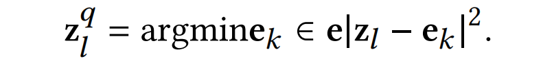

# Learning Transferable TS Classifier

## Abstract

1. 本篇论文着眼于多领域时间序列数据的可迁移知识。由于不同领域中时间序列数据的特性存在显著差异，例如通道数量和时间分辨率的变化。

2. 论文中提出了 CrossTimeNet ，一个关键特性是新设计的时间序列标记化模块，它能够基于重构优化过程有效地将原始时间序列转换为一系列离散令牌。

3. 论文将预训练语言模型（PLM）视为编码器网络的初始化，探究将PLM学到的知识转移到时间序列领域的可行性，以发展通用时间序列表示。

## Architecture

`CrossTimeNet` 包含三个组件：

1. 时间序列 tokenization：将连续的时间序列数据转成离散的 tokens，这是为了建立跨领域的统一表征。

2. 跨领域 自监督预训练模型：这个阶段需要完成 双向 token 预测任务。在这个任务中，随机的 tokens 被 mask，用于逼迫模型推断 missing 的信息。由此学习到强大的时间序列数据的表征。

3. 下游的特殊领域任务 微调：模型经历特殊的调整去适应和擅长于某个领域的任务，比如分类任务。微调过程串联了从预训练过程中得到的大量的 knowledge。

   微调任务的操作是很仔细的，为了保证预训练模型既精通于特殊的任务，同样保持了之前从跨领域任务中学到的洞察力。

## Tokenization

> 时间序列的处理困难主要来自于：channel 数量可变、物理现象表征的不同、时间分辨率不同。比如金融数据很简单，而多通道脑电波数据（multichannel EEG）就很复杂

一个有前途的方法：channel independent：将每个 channel 分开来看，但是这种方式忽略了channel 之间的依赖关系。

> 这些关系有些时候是很重要的，比如在医疗健康领域不同生理信号之间的联系。所以一个可以平衡泛化性和保留关键的通道间信息的 model 就很重要了。
>
> 这篇论文中提出的 tokenize 方法优势：即可以串联起全方位的对跨领域的时间序列的信息，也可以克服由于它们的多样性而形成的固有挑战

> 虽然之前的某些工作：SAX 和 SFA，但是
>
> 1. 计算成本太高
> 2. 这些方法对自监督的预训练学习限制太多
> 3. 需要手动调整，导致引入了主观性，限制了其伸缩性

本论文中使用的是 auto-encoder 的框架来进行时间序列压缩，步骤如下：

1. 沿着时间线维度，将时间序列转变成 sequence patches。（分片操作）

2. 这些 patches 将进入 auto-encoder 架构中

3. 将每个 patch 映射到一个潜在表征中，这里使用 EncoderTCN 架构，因为它能捕捉长范围的依赖以及其计算效率

   

4. 在 Encoder 之后是量子化 vector 步骤。每一个潜在表征都会被映射到最近的 vector 中，这个 vector 是在一个 codebook 中的一群向量，映射关系是计算潜在表征与 codebook 中每个向量的 MSE 的 argmax（下标）

   

5. Decoder 从量化的向量中重建时间序列

   

在优化中，特别值得注意的是，最近邻选择过程是不可微的，导致梯度计算过程会出问题。

## Self-supervised Pre-training

### Masked Token Prediction

实现跨领域的自监督优化两个关键目标：

1. 能够学习丰富的上下文信息，困难在于：时间序列数据中对某一点的理解被它的前面和后面的元素显著增强
2. 在自监督优化损失中，对预测目标保持一定程度的抽象，有利于提高预训练模型的可转移性，由于噪声和非约束特性，在原始空间中直接构造自监督信号会在很大程度上限制模型的容量。

模型提出了超过 30% 的mask radio 的方式进行 masked token prediction，这是为了逼迫模型从可见数据中学习隐藏表示。

## Pre-trained Language Model as Encoders

> 目前，时间序列自监督学习领域的主干网络主要利用卷积神经网络或者 Transformer 架构
>
> 鉴于本篇论文中的 跨领域的自我监督的预训练，所选择的主干架构必须表现出高度的普遍性，以有效地满足不同的领域
>
> 使用预先训练好的语言模型作为主干网络显著提高了性能，标志着在时间序列分析中取得优越结果的重大飞跃。

使用 BERT 的 masked language model（MLM）和 next sentence prediction（NSP）两个任务，去作为网络的初始化基础模型。

这是基于 BERT 在捕获上下文依赖关系方面已被证明具有多功能性和鲁棒性，成为跨领域自监督学习框架的理想候选对象。

> 因此，采用预先训练好的语言模型作为主干，是时间序列分析领域的一种新颖和有前途的途径

事实上这也有挑战：

虽然可以直接利用 tokenizer 的 codebook embedding，但与BERT的单词嵌入相比，嵌入大小和表征空间存在明显差异。

解决：

使用了一个单词映射机制【18】，随机为每个标记分配一个 从BERT的词汇表中选择的 相应的 单词

## Downstream Task Adaptation

## 单词

depict：描绘

discretation：离散

tailor-made：特制的

potent：强大的（potential：有潜力的）

harness：串联

meticulously：细致的，一丝不苟的

proficiency：熟练，精通

insight：洞察力

distinct：不同的，有区别的，清楚的

inherent：固有的（inherit：继承）

variability：可变性

modality：形式，形态

temporal resolution：时间分辨率，可以理解为 `DeltaTime`

promising approach: 有前途的方法

oversight：疏忽

retention：保留，记忆力

adopt：采用

a direct yet under-explored path：一条直接但又未被充分探索的道路？

accommodate：乐于助人的，容易适应的

preserve：保持，保护

multi-faceted：多方面的

endeavor to do：努力去做

versatile：多才多艺的，多种用途的

the full spectrum：全范围的，全方位的

exhibit：展示，展览（inherit：继承）

subjectivity：主观性

In light of：鉴于，根据

latent representation：潜在表征

stems from：源于

formulate：构架

predicated on：基于