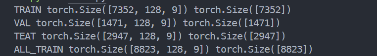
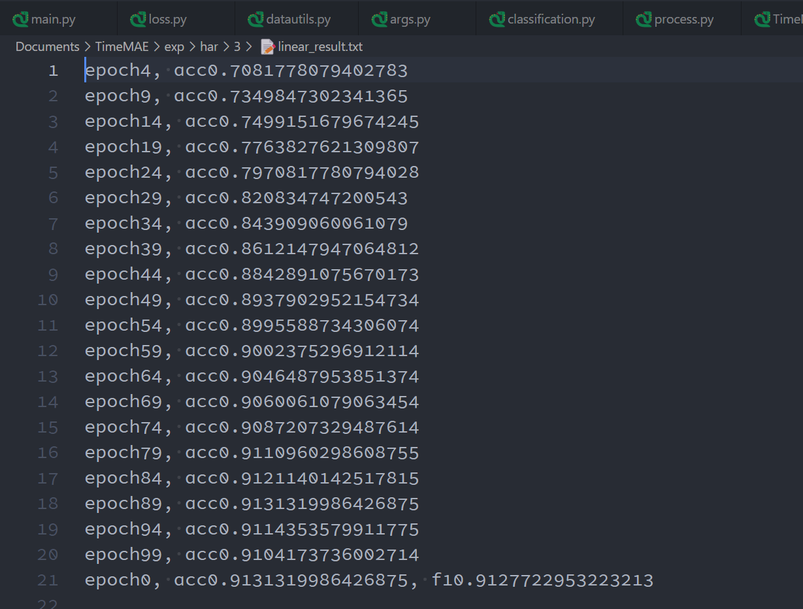
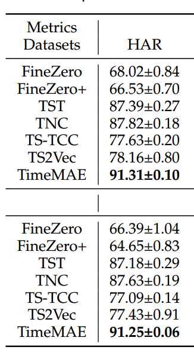
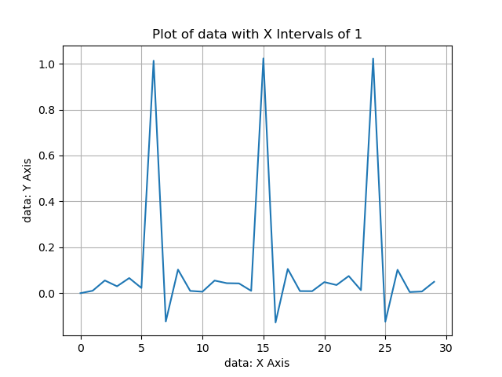
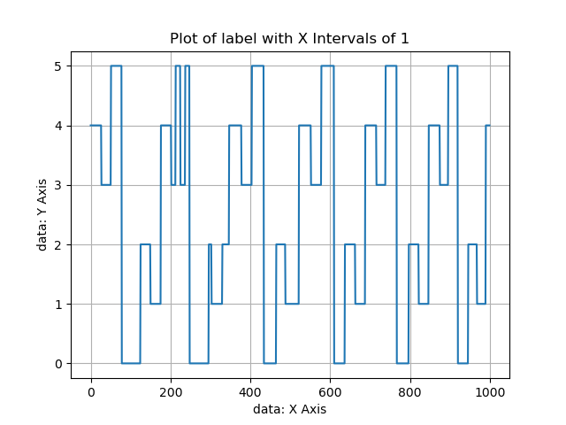
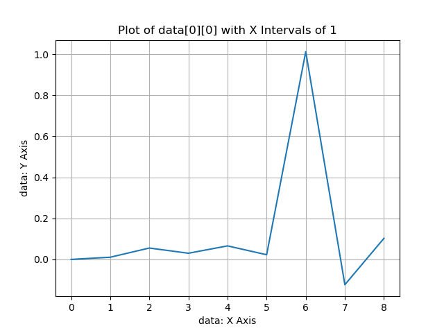

# About TimeMAE

## 代码结构

- `dataset.py`
  定义数据集的类，定义了该数据集的一些内置方法

- `datautils.py`
  数据集分类和处理

- `model`
  - `layers.py`
    `transformer` 的 layers 层
  - `TimeMAE.py`
    TimeMAE 模型

- `args.py`
  根据 `datautils` 中处理数据集的方法设置参数。
  并设置其他参数，比如 cuda 之类

- `classification.py`
  分类器，只有两个方法

- `loss.py`
  计算 loss

- `process.py`
  定义训练类和训练函数

- `visualize.py`
  可视化结果

- `main.py`
  运行整个流程

- `run.sh`
  脚本文件，用于运行 `main.py` 和设置超参数
  运行三次，猜测可能是计算误差。

## 数据集介绍
仅介绍 HAR 数据集：使用 load_HAR 函数，可以发现：TRAIN_DATA_ALL, TRAIN_DATA, TEST_DATA 分别用于预训练、微调和测试。其中各个数据集的规模如下：



其中 TRAIN_DATA_ALL 是 TRAIN 和 VAL 的拼接。

**重点：**
在设定了 batch-size 之后，进入 encoder 的 tensor 结构是：(batch_size, sequence_length, dimension) =（128， 7， 64）


## 代码介绍

在模型中，使用自定义多层的 transformer 模型 TransformerBlock 做 Encoder，如下：
```python
class Encoder(nn.Module):
    def __init__(self, args):
        super(Encoder, self).__init__()
        d_model = args.d_model
        attn_heads = args.attn_heads
        d_ffn = 4 * d_model
        layers = args.layers
        dropout = args.dropout
        enable_res_parameter = args.enable_res_parameter
        # TRMs
        self.TRMs = nn.ModuleList(
            [TransformerBlock(d_model, attn_heads, d_ffn, enable_res_parameter, dropout) for i in range(layers)])

    def forward(self, x):
        for TRM in self.TRMs:
            x = TRM(x, mask=None)
        return x
```

- d_model 表示 Transformer 编码器的隐藏层维度。
- attn_heads 表示注意力头的数量。
- d_ffn 是 FeedForward 层的隐藏层维度，这里设置为隐藏层维度的 4 倍。
- layers 表示 Transformer 编码器的层数。
- dropout 是 dropout 概率。
- enable_res_parameter 是一个布尔值，表示是否启用残差连接中的可学习参数。
- self.TRMs 是一个由多个 TransformerBlock 组成的列表，构建了 Transformer 编码器。

## 运行结果
在服务器上搭建环境，运行之后的结果为（仅 HAR 数据集）：



与论文中对比，可见结果非常符合。



## 修改和调整

要求用 BERT 的网络架构和网络参数初始化模型，并替换 TimeMAE 的Encoder。这里做了一些尝试，修改了 TimeMAE 的 Encoder 部分：

```python
from transformers import BertModel, BertConfig

class Encoder(nn.Module):
    def __init__(self, args):
        super(Encoder, self).__init__()
        bert_config = BertConfig(
            hidden_size=args.d_model,
            num_hidden_layers=args.layers,
            num_attention_heads=args.attn_heads,
            intermediate_size=4 * args.d_model,
            hidden_dropout_prob=args.dropout,
            attention_probs_dropout_prob=args.dropout
        )
        self.bert_model = BertModel(config=bert_config)

    def forward(self, x):
        x = self.bert_model(x)
        x = x.last_hidden_state
        return x
```

但是这里遇到了一系列问题：BertModel 接收的参数是一个规模为 （batch_size, sequence_length）的 **整形** tensor，而这里的时间序列数据是一个规模为 (batch_size, sequence_length, dimension) =（128， 7， 64）的浮点型 tensor。使用了一些降维方式，但是仍然无效。

## TODO

研究如何将数据映射为 BertModel 可接受的输入方式。


## 论文精读

### MCC & MRR 优化
在论文摘要中，**Masked Codeword Classification (MCC)** 任务和 **Masked Representation Regression (MRR)** 优化是两种预文本任务，用于自监督学习框架中以提高模型学习效果。下面是对这两个任务的解释：

#### Masked Codeword Classification (MCC) ：掩码码字分类

- **目的**：MCC任务的目的是提高模型对时间序列数据中各个部分（尤其是被随机掩盖的部分）的理解和表示能力。
- **工作方式**：在进行MCC任务时，模型首先将时间序列的一部分随机掩盖。然后，模型需要预测这些被掩盖部分的内容。这一预测不是直接恢复原始数据，而是将掩盖的部分映射到一个预定义的词汇表（或代码字集）上，模型需要预测每个掩盖部分最可能对应的代码字。
- **作用**：这种方法强迫模型学习时间序列中局部信息的高层次抽象表示，并通过分类任务来加深对时间序列局部特征的理解。

#### Masked Representation Regression (MRR) 优化

- **目的**：MRR优化的目标是提升模型在处理和理解时间序列数据中被掩盖部分的能力，特别是在连续值预测方面。
- **工作方式**：在MRR任务中，模型同样需要处理含有被随机掩盖部分的时间序列。不同于MCC的是，MRR要求模型预测被掩盖部分的实际数值表示，而非进行分类。这通常涉及到一个回归任务，模型需要生成一个接近于原始被掩盖部分的连续数值向量。
- **作用**：通过这种方式，MRR促进模型学习到更精细、更接近于数据真实分布的表示。这有助于模型捕获时间序列数据的细微变化，提高模型对数据的整体理解。

总体而言，MCC和MRR这两种预文本任务通过不同的方法促进模型更好地学习和理解时间序列数据，增强模型的泛化能力。MCC通过分类任务加强对离散特征的学习，而MRR通过回归任务提升对连续数值特征的理解，二者共同作用，使模型能够更全面、更深入地捕捉时间序列数据的特性。

> **self-supervised learning**
>
> 自监督学习是一种特殊的无监督学习，但它模拟了监督学习的过程。在自监督学习中，模型从输入数据本身自动生成伪标签，然后使用这些伪标签来训练。这种方法利用数据的内在结构来学习数据的表示，而不是依赖于外部标注。自监督学习的典型应用包括自然语言处理中的语言模型预训练、图像处理中的预训练模型等。

### 前人所作的工作 & 问题 -> TimeMAE 的提出

#### 前人所作的工作 & 问题

1. 本文聚焦的问题在于：虽然先进的传感器设备使收集时间序列数据变得容易，但是在现实场景中，不可能全是先进的传感器，所以某些场景中获得大量准确的标注时间序列数据是耗时的，容易出错的。然而传统的 Transformer 架构严重依赖大量的训练标签。

2. 前人的工作：self-supervised learning 在从未标注数据中学习可转移的模型参数已经取得了巨大的成功。这种方法基本方案是首先获得一个预训练（pre-training）模型，从原始未标注数据中优化一个设定的前置任务。然后通过微调（finetuning）形成最终的模型。当前工作中，对比学习范式最为流行。对比学习的共同范式是学习 embedding，并且假设这些 embedding 对各种规模输入的扭曲具有不变性。

   这种方法有很多缺点：

   - 尽管这些方法很流行，但是**不变性假设在现实世界中可能不总是成立**。并且它在开发数据增强策略中带来太多归纳偏差，并且在负采样中引入额外的偏差。

   - 更大的缺点是：它们本质上使用**单向编码器的（unidirectional encoder）**方案来学习时间序列的表示，限制了**上下文表示（contextual representations）**的提取。

3. 前述问题目前有很好的方式来解决，也就是掩码自编码器（Masked AutoEncoder）[ps：缩写就是 MAE]，主要理念就是将遮蔽样式的输入编码到潜在空间，然后通过编码器和解码器恢复原始输入。在这个领域，最成功的案例就是基于 Transformer 的 BERT 模型。受此启发，基于 Transformer，已经有人提出了一项开创性工作，即直接将原始时间序列（raw time series）作为输入，通过逐点回归优化恢复完整输入。但是这个方式**同样有很多缺点**：

   - 计算过于复杂，计算成本大。
   - 弱泛化性能，表征结果有限。主要是由于 time series 与语言数据不同，每个时间步骤可以通过其临近点轻松推断。（而语言需要理解上下文关系）
   - time series 的区分模式通常是子序列的形式，每个单点值只能携带非常稀疏的语义信息。
   - 由于采用了 Mask 策略，这会导致 Pre-Training 时一定比例的位置被换为了 Masked Embedding，而这些用于 Mask 的人工符号在 Finetuning 阶段是不存在的。导致了 Pre-Training（自监督预训练） 和 Finetuning（目标任务优化）之间的差异。

#### TimeMAE 的提出

1. TimeMAE 仍然是一种 Masked Auto-Encoder Architecture。它的新颖之处在于不是单独对每个时间步建模，而是通过 Window Slicing（窗口切片）将每个时间序列分割一系列非重叠的子序列。这种策略：

   - 增加了遮蔽语义的信息密度
   - 由于序列长度较短，还显著节省计算成本和内存消耗。

   对这些重新定义的语义单元执行 Mask 操作，来进行双向编码时间序列表示（bidirectional）。

   **重点：论文指出：mask-radio 要高达 60% 才能最匹配时间序列的表示（代码中是 9: 16）。**

2. TimeMAE 也遇到了挑战：为了解决 Mask 位置引起的差异，其 Auto-Encoder Architecture 是 Decoupled 的。Visible 部分和 Mask 部分分别用两个不同的 Encoder 提取其上下文表征。

   为了恢复 Mask 部分，制定 MCC & MRR 两个任务指导预训练过程。这两个任务**旨在将 Mask 位置的预测表示与提取的目标表示对齐。**由于有 Decoupled Encoder，所以 Network Architecture 也是连接起来的。

3. 对 TimeMAE 的总结：（Based on GPT-4）

   - 提出了一个在时间序列表示上概念上简单却非常有效的自监督范式，该范式将基本语义元素从点粒度提示到局部子序列粒度，并同时促进了从单向到双向的上下文信息提取。
   - 提出了一个用于时间序列表示的端到端解耦自编码器架构，在该架构中：（1）我们解耦了遮蔽输入和可见输入的学习，以消除由遮蔽策略引起的差异问题；（2）我们形式化了基于可见输入恢复缺失部分的两个前置任务，包括MCC和MRR任务。
   - 在五个公开可用的数据集上进行了广泛的实验，以验证TimeMAE的有效性。实验结果清楚地展示了新制定的自监督范式和所提出的解耦自编码器架构的有效性。

#### 两个相关工作

1. 时间序列分类问题

   - 基于模式的方法

     计算成本与时间序列样本的数量和序列长度严格相关，成为实际应用中的主要瓶颈

   - 基于特征的方法

     依赖于特征表示的质量

   - 基于深度学习的方法

     需要大量的训练数据，难以获得大量的标注数据，直接使用深度神经架构可能不会带来满意的结果

2. 时间序列分析的自监督问题

   提出了很多对比学习方法（TimeNet、TST、T-Loss、TNC、TS-TCC、TS2Vec），但是他们实际上都有前文提到的问题：实际问题中，不能总是认为不变性假设总是存在。

### TimeMAE Pre-Training Architecture

#### 整体介绍

将输入序列投影到潜在表示中，随后通过 Mask 策略将整个输入分为 visible 输入和 mask 的子序列。然后，采用 Decoupled Auto-Encoder Architecture，利用两个相应的编码器学习 visible 位置和 mask 位置的表示。

1. Encoder 层面：使用一系列基础的变换器编码器块来提取可见输入的上下文表示，同时利用几层基于交叉注意力的 Transformer Encoder 网络来学习遮蔽位置的表示。
2. Decoder 层面：通过预测基于 visible 输入的所有缺失部分来执行重构任务，这一过程得到了两种新构建的目标信号的帮助：
   - 增加了一个 Tokenizer 模块为每个 mask 区域分配其自有的 codeword，允许训练 code classification 任务。
   - 采用孪生网络架构（siamese network architecture）生成连续的目标表示信号，旨在执行连续的目标表示回归任务（target representation regression task）。

#### feature encoder layer

1. 聚焦问题：

   - 如何为预训练选择信息丰富的基本语义单元
   - 如何实现时间序列的双向编码器

2. window slicing strategies

   首先再提及了前文所述的将时间序列做单点处理的缺陷：时间冗余、信息密度低、每个遮蔽点都可以从其邻近点轻松推断出来。本文采用了 window slicing 策略：每个时间序列可以被处理成一系列子序列单元，每个局部子序列区域保留了更丰富的语义信息，并可以确保重构任务的挑战性。

   需要注意的是，这样的论点也可以得到基于形状的模型的支持，在这些模型中，许多与类标签相关的具有区分性的子序列被提取为时间序列分类的 useful 模式特征。例如：我们需要通过许多局部波形区域而不是单个点来识别异常的心电图（ECG）信号。

   在建模这些子序列单元的序列依赖性之前，我们需要通过 Featuring Encoder 将每个元素编码成潜在表示。这里，使用1-D卷积层来提取跨通道的局部模式特征。重点：**不同的子序列在 Featuring Encoder Layer 共享相同的参数。**

3. Masking Strategies

   为了实现通过 bidirectional encoding 方案学习时间序列的上下文表示的目标，按照文献[16]的方法，通过遮蔽策略构造受损输入。假设 $S_v/S_m $​ 是遮蔽/可见位置的数量。通过这种方式，可以同时编码每个位置的更全面的上下文表示，包括之前和未来的上下文。

   使用 $Z_v$ 来表示可见位置的 embedding ，同时 $Z_m$​ 是遮蔽位置的 embedding 。采用随机遮蔽策略来形成受损输入。这意味着每个子序列单元在构造自监督信号时都有相同的被遮蔽概率。它可以确保每个输入位置的表示质量在重构优化期间得到充分提升。

   > Tips:
   >
   > 1. 在每个预训练时期都会随机动态地遮蔽时间序列，以进一步增加训练信号的多样性。
   >
   > 2. TimeMAE 还鼓励保留较高的 mask radio。这是因为 mask radio 在决定恢复任务是否足够 challenging 以帮助 Encoder 携带更多信息方面很重要。通常，较高的遮蔽比例意味着依赖这些可见邻域区域的恢复任务更难解决。相应地，更具表达力的网络容量可以在预训练的编码器网络中被编码。
   > 3. 论文发现约60%的遮蔽比例可以实现最佳性能，这与之前工作中15%的遮蔽比例不同。
   > 4. 无论是窗口切片还是遮蔽策略都对时间序列输入是不可知的，这不会像对比学习中的数据增强那样带来太多的归纳偏见。

#### representation learning for time series

1. 可见位置的表征

   采用了包含 Multi-head Attention Layer 和 Feed-Forward Layer 的经典 Transformer 架构，用于学习在 visible 区域的上下文表示。每个输入单元可以获得所有其他位置的语义关系。

   由于 window slicing，使用 self-attention 机制处理长序列的瓶颈问题得到了缓解（因为点数据变成了区间，数量减少很多）

   由于 Transformer 并不能处理位置信息，所以输入还要加入位置信息，所以最终 visible 部分的 input embedding 就是 projected representations（投影表示）和 positional encoding 结合起来得到的。

   visible 部分的 input embedding 会被送入 Encoder 模块。在 Encoder 模块中有 $L_v$ 层 Transformer 模块，最后一层的输入代表了所有 visible 部分的全局上下文表示。

   > 这里只将 visible 部分送入 Encoder 模块，同时移除 mask 位置的表示。这样可以缓解由 mask token 引起的 pre-training 和 fine-tuning 之间的差异。这种策略消除了之前 feed-forward 过程中将 mask token 送入 Encoder 模块的困境

2. 遮蔽位置的表征

   将标准 Transformer Encoder 中的 self-attention 换成 cross-attention，形成 decoupled Encoder 模块 $F_{\theta}$。

   将 visible 和 mask 部分发送到 decoupled encoder 中，但是 mask 位置的 embedding 被替换为新初始化的向量 $z_{mask}$，同时保持相应的 position embedding。在 decoupled encoder 中做表征学习时，将 mask position 的表示视为 query embedding，同时将可见位置的 transformed embedding 视为输入以形成 key 和 value。

   形式上，mask query 的模型参数对所有 mask query 都是共享的。decoupled encoder 的第 $L_m$ 层输出表示了 $S_m$ 的 mask 位置的 transformed 上下文表示。

   > 注意：decoupled encoder 仅对 mask 位置的 embedding 进行预测，同时保持 visible 的 embedding 不更新。原因是：
   >
   > - 希望这样的操作可以帮助减轻反向传播的差异问题，通过这种分割操作， visible 输入的表示仅有之前的 encoder $H_{\theta}$ 负责。同时，decoupled encoder $F_{\theta}$ 主要关注 mask 位置的表示。
   >
   > - $F_{\theta}$ 的另一个优势是防止之后的 decoder prediction layer 对 visible 位置的表征学习，这样 encoder 模块 $H_{\theta}$ 可以携带更有意义的信息。

#### Self-supervised Optimization

1. MCC

   为每个局部子序列分配其自有的“编码词”。然后，这些分配的编码词作为缺失部分的代理监督信号。

   大多数当前的产品量化方法，主要思想是基于 cluster 操作，用由聚类索引组成的短代码来编码每个密集向量，其中所有索引形成 codebook vocabulary。尽管其近似误差低，但它实际上是一种 two-stage 方法，即独立地分配聚类索引和学习特征的提取。这样，codebook 的表示能力可能与从 Transformer Encoder 和 decoupled network 中提取的特征不兼容。因为这种不兼容性，如果天真地采用这些技术来分配离散监督信号，自监督训练的性能将直接受到影响。因此，论文中提出了一个标记器模块，它可以以端到端的方式将遮蔽位置的连续 embedding 转换成离散的 codeword。

   后面用 Temperature Softmax 代替了 argmax，并且使用 STE 的 trick 保证了反向传播的可偏微分性

2. MRR

   这部分比较简单，即算一个prediction representation与 target representation 的 MSE。其中target representation是经过momentum network的输出，而prediction representation是用visible的数据和mask token预测出的representation

   其中应用了 momentum-based moving average

   > import from ChatGPT
   >
   > 动量基础的移动平均这种策略广泛应用于各种优化算法中，特别是在深度学习模型的训练过程中，用来平滑参数的更新，以促进更快的收敛和减少训练过程中的波动。
   >
   > 在这个上下文中，动量系数用于控制先前梯度更新的影响程度。具体来说，它决定了在计算新的参数更新时，当前梯度与过去累积的梯度更新的相对重要性。这个系数通常表示为一个在0到1之间的值（例如0.9）。较高的动量系数意味着先前的更新在当前更新中占有更大的比重，从而使优化过程更加平滑。

### 数据作图

将三维张量数据（sub-series numbers，cycles in a sub-series，points in a cycle）平铺在一维：



将一维张量标签（sub-series numbers）作图：



将一个 cycle 的图画出：


