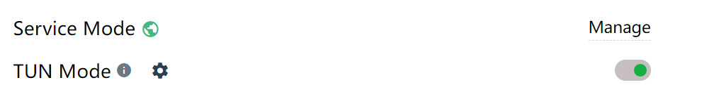
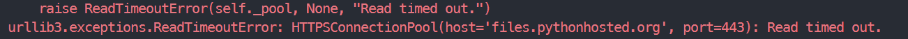

# 遇到的问题和解答

## Environment
### Problem 1
#### Description
当直接在 envs 里修改 anaconda 的环境名时，终端输入 clear 会报错：

```bash
    terminals database is inaccessible
```
#### Solution
在终端输入：

```bash
    mv $CONDA_PREFIX/bin/clear $CONDA_PREFIX/bin/clear_old
```
即可。

### Problem 2
#### Description
连接学校校内访问 VPN 之后，由学校密码登录界面无需输入验证码确定是在校内，但仍然无法连接校内服务器。
#### Solution
CFW 打开 TUN Mode，介绍可以看这里：[TUN Mode](https://docs.gtk.pw/contents/tun.html)，其实就是对于不遵循系统代理的软件，TUN 模式可以接管其流量并交由 CFW 处理。
**TUN Mode需要先安装上方的Service Mode**，不然 TUN Mode 模式开了也没用。安装完成的标志绿色小地球：



### Problem 3
#### Description
Linux 在某个 conda 环境中，使用 pip 安装的包，不在 anaconda2/envs/ml/lib/python3.8/site-packages 中

#### Solution
运行 python -m site，显示当前 Python 解释器的信息，包括 site-packages 目录。检查这个目录，发现 pip 安装的包在 ~/.local/lib/python3.8/site-packages 中。

## Latex
### Problem 1
#### Description
标题中直接出现下划线时，maketitle 处报错：

```bash
    Missing $ inserted.
```
#### Solution
Latex 标题中如果出现下划线，可以使用 \_ 代替下划线，或者不使用下划线。

## Network
### Problem 1
#### Description
pip 下载超时，报错：


#### Solution
pip install X --default-timeout=100