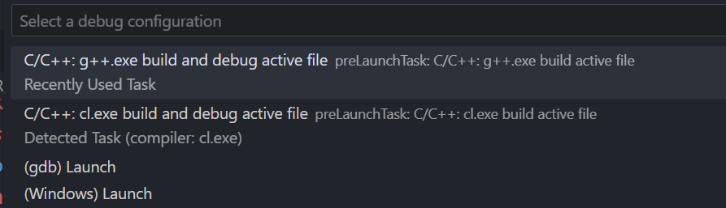
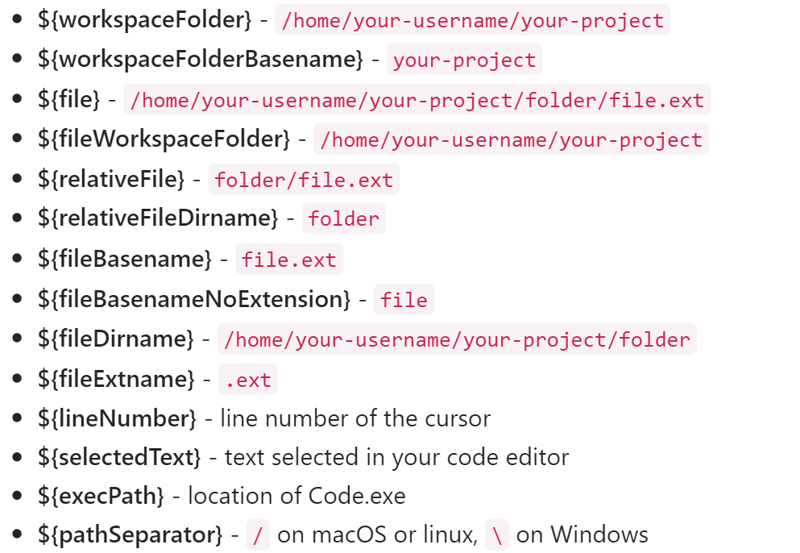

# Vscode & c++ 多文件调试技术
> 本文不涉及 makefile 和 cmake 的原理和使用
> 这东西太复杂了，感觉不如 vs 一键运行

本文基于 Vscode 官方文档：[mingw-config](https://code.visualstudio.com/docs/cpp/config-mingw)

## Vscode & c++ 配置文件原理
Vscode 在工作区会默认创建 .vscode 文件夹，用于放置配置文件，其中最主要的就是 task.json 和 launch.json

其中 task.json 负责编译和生成可执行文件，本质上就是 g++ or gcc 的一堆参数

launch.json 主要负责调试工作，这其中包括你的程序在哪个位置，你用什么工具来调试，调试的时候需要给调试工具传什么参数等

Vscode就是先跑 tasks.json 任务，再跑 launch.json。

说明一点：Vscode调用任务是根据 lable 标签识别的。

再说明一点：在完整的路径中，**不要有任何中文**，否则都可能找不到这个 file 或者 dir。

#### 生成配置文件
在 入口函数文件（active file） 处有一个 setting 图标，选择使用 g++ 构建和调试：



这样就可以默认生成 task.json 和 launch.json 两个文件了。
#### task.json
下文是一个经典的 task.json 的示例，实质上就是一个 g++ 命令，以及一些选项和提示。

```json
{
    "tasks": [
        {
            "type": "cppbuild",
            "label": "C/C++: g++.exe build active file",
            "command": "D:\\MinGW\\mingw64\\bin\\g++.exe",
            "args": [
                "-fdiagnostics-color=always",
                "-g",
                "${file}",    // 只有当前文件
                "-o",
                "${fileDirname}\\${fileBasenameNoExtension}.exe"
            ],
            "options": {
                "cwd": "${fileDirname}"
            },
            "problemMatcher": [
                "$gcc"
            ],
            "group": "build",
            "detail": "Task generated by Debugger."
        }
    ],
    "version": "2.0.0"
}
```

关于更多的参数解释可以看 Vscode 的官方文档：[variables-reference](https://code.visualstudio.com/docs/editor/variables-reference)

比较经典的：

所以说只需要将所有要编译的文件加入 `"${file}"` 参数后面即可。

例如有这样三个文件：main.cpp, A.cpp, A.h，直接将 A.cpp 加入 args 后面即可。

```json
    "args": [
        "-fdiagnostics-color=always",
        "-g",
        "${file}",    // 只有当前文件
        "${fileDirname}\\A.cpp"
        "-o",
        "${fileDirname}\\{fileBasenameNoExtension}.exe"
    ],
```

这样就可以编译出你想要的可执行文件。
#### launch.json
launch.json 主要是用于调试。下文是一个经典的 launch.json 示例：
```json
{
    "configurations": [
        {
            "name": "C/C++: g++.exe build and debug active file",
            "type": "cppdbg",
            "request": "launch",
            "program": "${fileDirname}\\${fileBasenameNoExtension}.exe",
            "args": [],
            "stopAtEntry": false,    // 这里是 true 即可开头启动断点
            "cwd": "${fileDirname}",
            "environment": [],
            "externalConsole": false,
            "MIMode": "gdb",
            "miDebuggerPath": "D:\\MinGW\\mingw64\\bin\\gdb.exe",
            "setupCommands": [
                {
                    "description": "Enable pretty-printing for gdb",
                    "text": "-enable-pretty-printing",
                    "ignoreFailures": true
                },
                {
                    "description": "Set Disassembly Flavor to Intel",
                    "text": "-gdb-set disassembly-flavor intel",
                    "ignoreFailures": true
                }
            ],
            "preLaunchTask": "C/C++: g++.exe build active file"
        }
    ],
    "version": "2.0.0"
}
```
其实要改的就只有 `"stopAtEntry": false` 这一行。

将其改为 `true` 即可在函数入口处停止。点击到下一个断点即可停在第一个断点处。

#### c_cpp_properties.json
这个文件是控制 c 和 cpp 文件编译运行的额外特性（properties）的。**可选**！

我们可以在这个文件中自定义：编译器，include 路径，C++ 标准（比如添加 C++ 17 标准）。

添加这个文件：搜索 C/C++: Edit Configurations

```json
{
    "configurations": [
        {
            "name": "Win32",
            "includePath": [
                "${workspaceFolder}/**"
            ],
            "defines": [
                "_DEBUG",
                "UNICODE",
                "_UNICODE"
            ],
            "windowsSdkVersion": "10.0.22000.0",
            "compilerPath": "D:/MinGW/mingw64/bin/g++.exe",
            "cStandard": "c17",
            "cppStandard": "c++17",
            "intelliSenseMode": "gcc-x64"
        }
    ],
    "version": 4
}
```
可以指定 C++ 的标准、编译器路径、智能提示、除标准库和当前工作区的头文件外的库（直接加到后面就行）。一般再说，windows 会直接默认编译器为 msvc（装了 VS 的话）。 