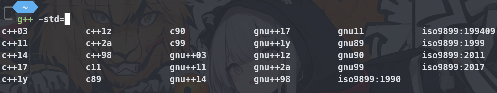

# g++ & gdb 命令
## `g++`

常用的选项有以下几种：

| 选项     | 作用                                                         |
| -------- | ------------------------------------------------------------ |
| -o       | 指定生成文件的文件名                                         |
| -g       | 在目标文件中添加调试信息，便于 gdb 调试                      |
| -Wall    | 显示所有警告（建议使用）                                     |
| - Werror | 视警告为错误，出现警告即放弃编译                             |
| -w       | 不显示任何警告信息                                           |
| -v       | 显示编译步骤                                                 |
| -$O_n$   | 设置优化等级，$O_0$ 为不优化，$O_3$ 为最高等级优化，$O_1$ 为默认等级优化 |
| -std=    | 设置编译标准，如 -std=c++17                                  |

std 一般来说有这样一些：



一般来说，编译文件直接使用：

```bash
g++ -Wall [-g] A.cpp main.cpp -o main [-std=c++17]
```

即可。

## `gdb`

我们的可执行文件要能够被 `gdb` 调试，必须在编译时加上调试信息，也即是加上`-g`选项

gdb 相对来说较为复杂，实际上使用可视化调试更加简单，但是在没有这些可视化的情况下可以简单使用，在此总结一些基本的指令

### gdb 与 shell 切换
#### 进入 gdb
#### 返回 shell
#### 再返回 gdb

### 断点
#### 添加断点
#### 查看断点
#### 临时禁止断点和恢复
#### 删除断点

### 程序运行
#### 启动程序
#### 单步执行
#### 继续执行到下一个断点
#### 继续运行到指定位置
#### 跳过某函数/文件

### 变量监控
#### 打印变量
#### 显示变量
#### 监控变量